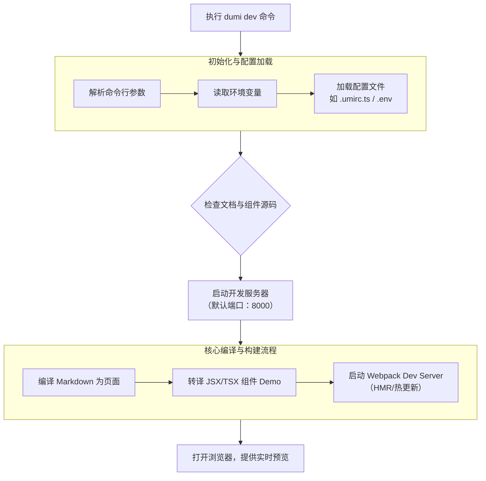

- ut start 最终会执行 packages/x 中的 start
- `tsx ./scripts/set-node-options.ts cross-env PORT=8001 dumi dev`

## tsx 是什么？

- 运行 ts 代码的执行器。
- tsc 一般把 ts 转 js，你再 node 运行，而使用 tsx 可以直接运行 ts 代码
- `tsx watch your-script.ts` 启动监听模式

```
你的 TypeScript 文件 (app.ts)
         |
         v
      tsx 运行时
   （内部使用 ESBuild）
         |
         v
内存中的 JavaScript 代码
         |
         v
      Node.js 执行
```

## scripts/set-node-options.ts 的作用？

- 一个启动项目的时候，分配内存的脚本

- NODE_OPTIONS
  - NODE_OPTIONS 是 Node.js 在启动时会自动读取的一个标准环境变量。
  - 当你设置 NODE_OPTIONS 后，Node.js 会在启动时自动应用这些选项，就像你在命令行中直接传递参数一样。
  - 它专门用于传递 Node.js 运行时自身的命令行选项，所以你**不能自定义参数**
  - 你可以用它来设置垃圾回收、内存限制、调试等多项运行时配置
  - 例如:

  ```bash
  # 指定内存大小
  NODE_OPTIONS='--max-old-space-size=4096' node app.js
  # 等价于
  node --max-old-space-size=4096 app.js
  ```

  - `--max-old-space-size` 设置V8引擎老生代内存上限。用于解决“JavaScript堆内存不足”错误

- 子进程会继承父进程的环境变量，所以子进程也会自动读取 NODE_OPTIONS。

## dumi dev 怎么执行的



1. Dumi 初始化 ├─ 读取 .dumirc.ts 配置 ├─ 加载插件 (dumi-plugin-color-chunk) ├─ 注册自定义 TechStack (AntdReactTechStack)(.dumi/theme/plugin.ts) ├─ 扫描文档目录 (docs/) ├─ 扫描组件目录 (components/) ├─ 解析路由 ├─ 加载主题 (.dumi/theme/) ├─ 配置 Webpack/Mako 构建器 └─ 启动开发服务器

## 最终文档界面上的导航栏是怎么配置的？
