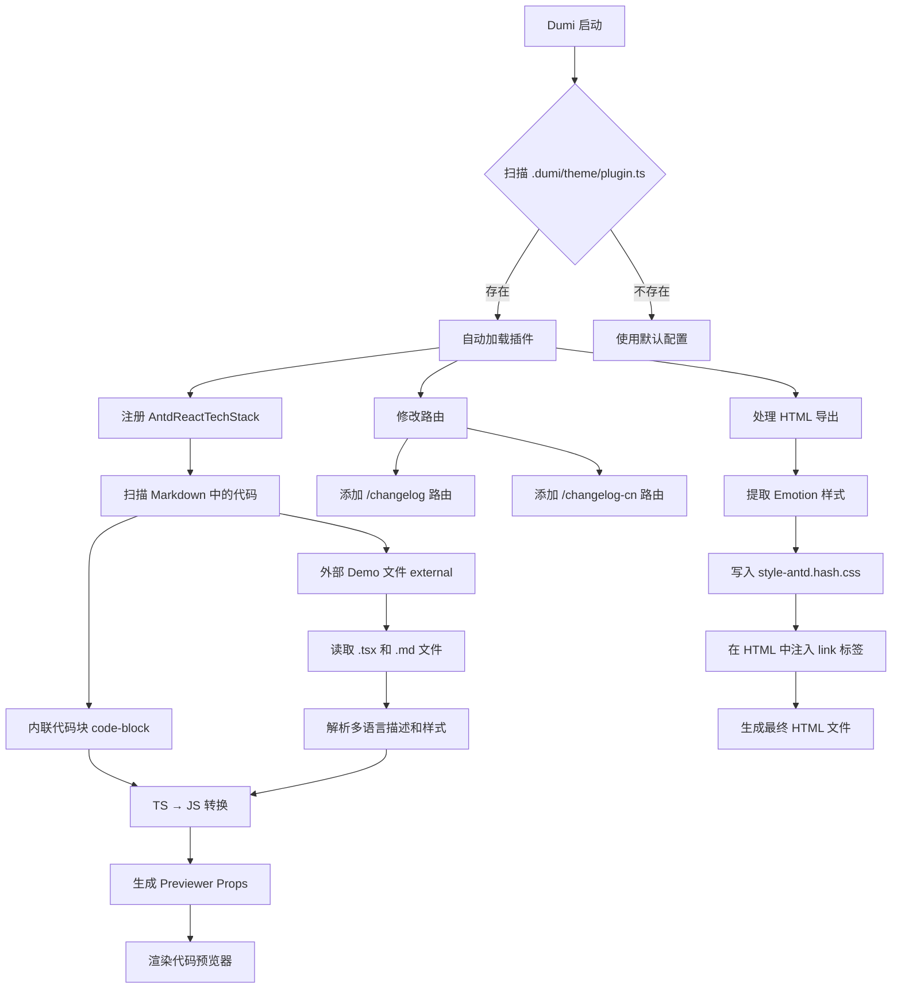

### **3️⃣ 工作流程图**



---

### **4️⃣ 关键代码段说明**

#### **a) Tech Stack 扩展**

```typescript
// 为在线编辑器注入依赖信息
props.pkgDependencyList = { ...devDependencies, ...dependencies };

// TypeScript 转 JavaScript
props.jsx = tsToJs(code);

// 解析 Demo 的多语言描述
props.description = blocks[locale]; // 'zh-CN' 或 'en-US'
props.style = blocks.style; // 自定义样式
```

#### **b) 路由扩展**

```typescript
// 添加 Changelog 路由（monorepo 根目录的 CHANGELOG 文件）
{
  id: 'changelog-cn',
  path: 'changelog-cn',
  file: resolve('../../../../CHANGELOG.zh-CN.md'),
}
```

#### **c) SSR 样式优化**

```typescript
// 1. 提取 Emotion 样式
const styles = extractEmotionStyle(file.content);

// 2. 写入独立 CSS 文件
const cssFile = writeCSSFile('antd', ids.join(''), cssContent);

// 3. 注入 <link> 标签
html.replace('</head>', `<link rel="stylesheet" href="${cssFile}"></head>`);
```

---

### **5️⃣ 为什么需要这个插件？**

| 问题                        | 解决方案                            |
| --------------------------- | ----------------------------------- |
| ❌ 用户只会 JS，不会 TS     | ✅ 自动转换 TS → JS，用户可直接复制 |
| ❌ 在线编辑器缺少依赖信息   | ✅ 自动注入 `package.json` 依赖     |
| ❌ Demo 文档分散在多个文件  | ✅ 自动解析 `.md` 和 `.tsx` 文件    |
| ❌ Changelog 不在文档目录   | ✅ 手动添加路由引入根目录文件       |
| ❌ SSR 首屏样式闪烁（FOUC） | ✅ 提取 CSS-in-JS 为独立文件        |

---

### **6️⃣ 与 `.dumirc.ts` 的关系**

```typescript
// .dumirc.ts (配置文件)
export default defineConfig({
  ssr: { builder: 'mako' }, // 配置 SSR
  hash: true, // 配置文件哈希
  // ...
});

// .dumi/theme/plugin.ts (插件文件)
// - 不需要在 .dumirc.ts 中引入
// - 自动加载，增强 Dumi 的功能
// - 处理更底层的逻辑（路由、HTML、样式）
```

**区别：**

- **`.dumirc.ts`** = 用户配置（声明式）
- **`plugin.ts`** = 插件逻辑（编程式）

---

### **7️⃣ 类比理解**

```
Dumi 框架 = 房子的框架
.dumirc.ts = 装修方案（选择地板、墙纸、家具）
plugin.ts = 水电工程师（改造电路、增加插座、优化管道）

约定式加载 = 装修公司看到 .dumi/theme/plugin.ts 就知道要启用定制工程
```

---

## 🎯 总结

这个插件是 **Ant Design X 文档站点的核心定制逻辑**，通过 Dumi 的约定式加载机制，自动增强了：

1. ✅ **开发体验** - TS → JS 自动转换
2. ✅ **在线预览** - 依赖信息自动注入
3. ✅ **多语言支持** - Demo 文档解析
4. ✅ **性能优化** - SSR 样式提取
5. ✅ **路由扩展** - Changelog 页面

所有这些功能都**无需配置**，Dumi 启动时自动加载！🚀

---

让我分析 Dumi 的启动和文件加载顺序，通过搜索相关配置和约定来理解整个流程：

现在让我搜索 Dumi 的官方文档和约定式加载顺序：

现在让我创建一个完整的 Dumi 文件加载顺序图：

## 📚 Dumi 文件加载顺序详解

基于 Dumi 的约定式架构和你的项目实际情况，完整的加载顺序如下：

---

## 🔄 完整加载流程（从启动到渲染）

```mermaid
graph TB
    Start[npm run start / dumi dev] --> Config[1. 读取 .dumirc.ts]

    Config --> Plugin1[2. 自动加载 .dumi/theme/plugin.ts]
    Plugin1 --> |注册 TechStack| P1[扩展 ReactTechStack]
    Plugin1 --> |修改路由| P2[添加 Changelog 路由]
    Plugin1 --> |SSR 钩子| P3[HTML 样式提取]

    Config --> GlobalFiles[3. 加载全局约定文件]
    GlobalFiles --> G1[.dumi/global.css - 全局样式]
    GlobalFiles --> G2[.dumi/loading.js - 加载动画]

    Config --> Theme[4. 加载主题配置]
    Theme --> T1[.dumi/theme/themeConfig.ts]

    Theme --> Layout[5. 加载布局组件]
    Layout --> L1[layouts/GlobalLayout.tsx - 全局布局]
    Layout --> L2[layouts/DocLayout.tsx - 文档布局]
    Layout --> L3[layouts/IndexLayout.tsx - 首页布局]

    L1 --> Provider[6. 初始化 Provider]
    Provider --> PP1[SiteThemeProvider - 主题]
    Provider --> PP2[ConfigProvider - Antd 配置]
    Provider --> PP3[StyleProvider - CSS-in-JS]
    Provider --> PP4[SiteContext - 站点状态]

    PP1 --> Styles[7. 注入全局样式]
    Styles --> S1[GlobalStyles 组件]
    S1 --> S2[Reset.tsx - 重置样式]
    S1 --> S3[Common.tsx - 通用样式]
    S1 --> S4[Markdown.tsx - Markdown 样式]
    S1 --> S5[Highlight.tsx - 代码高亮]
    S1 --> S6[其他样式组件...]

    Styles --> Scan[8. 扫描文档和组件]
    Scan --> Doc1[docs/ - 文档目录]
    Scan --> Doc2[components/ - 组件目录]
    Scan --> Doc3[根据 .dumirc.ts 的 resolve 配置]

    Doc1 --> Route[9. 生成路由]
    Doc2 --> Route
    Doc3 --> Route
    Route --> R1[/components/bubble]
    Route --> R2[/guide/start]
    Route --> R3[/changelog 额外路由]

    Route --> Render[10. 渲染页面]
    Render --> Page1[Header - 导航栏]
    Render --> Page2[Sidebar - 侧边栏]
    Render --> Page3[Content - 内容区]
    Render --> Page4[Footer - 页脚]

    Page3 --> Demo[11. 处理 Demo]
    Demo --> Tech[TechStack 处理]
    Tech --> TS[TS → JS 转换]
    Tech --> Deps[注入依赖信息]
    Tech --> MDParse[解析 Demo 的 .md]

    Demo --> Previewer[12. 渲染 Previewer]
    Previewer --> Code[代码展示]
    Previewer --> Preview[效果预览]
    Previewer --> Actions[操作按钮]
```

---

## 📂 详细加载顺序表

### **阶段 1: 配置初始化（启动时）**

| 顺序 | 文件路径                     | 作用                       | 是否约定式  |
| ---- | ---------------------------- | -------------------------- | ----------- |
| 1    | `.dumirc.ts`                 | 主配置文件                 | ✅          |
| 2    | `.dumi/theme/plugin.ts`      | 自定义插件                 | ✅ 自动加载 |
| 3    | `.dumi/theme/themeConfig.ts` | 主题配置（导航、分类排序） | ❌ 手动导入 |

---

### **阶段 2: 全局资源加载（构建时）**

| 顺序 | 文件路径           | 加载时机      | 说明             |
| ---- | ------------------ | ------------- | ---------------- |
| 4    | `.dumi/global.css` | HTML `<head>` | 全局 CSS 样式    |
| 5    | `.dumi/loading.js` | 首屏加载      | Loading 动画组件 |

---

### **阶段 3: React 组件树初始化（运行时）**

| 顺序 | 组件路径 | 层级 | 说明 |
| --- | --- | --- | --- |
| 6 | `layouts/GlobalLayout.tsx` | 🌳 根布局 | 最外层布局，包含所有页面 |
| 7 | `SiteThemeProvider.tsx` | ↓ Theme Provider | antd-style 主题提供者 |
| 8 | `common/GlobalStyles.tsx` | ↓ 全局样式注入 | 通过 `<Global>` 注入 CSS-in-JS |
| 9 | `layouts/DocLayout.tsx` | ↓ 文档布局 | 文档页面的布局（Header + Sidebar + Content） |
| 10 | `layouts/IndexLayout.tsx` | ↓ 首页布局 | 首页专用布局 |

---

### **阶段 4: GlobalStyles 内部加载顺序**

```tsx
// GlobalStyles.tsx 的加载顺序
<>
  <Reset /> // 1. 重置浏览器默认样式
  <Common /> // 2. 通用样式（布局、间距）
  <Markdown /> // 3. Markdown 内容样式
  <Highlight /> // 4. 代码高亮样式
  <Demo /> // 5. Demo 示例样式
  <Responsive /> // 6. 响应式样式
  <NProgress /> // 7. 进度条样式
  <PreviewImage /> // 8. 图片预览样式
  <InlineCard /> // 9. 内联卡片样式
  <ColorStyle /> // 10. 颜色相关样式
  <HeadingAnchor /> // 11. 标题锚点样式
  <SearchBar /> // 12. 搜索框样式
</>
```

---

### **阶段 5: 页面布局组件加载（按层级）**

#### **DocLayout（文档页面）**

```
DocLayout
├── Header          (.dumi/theme/slots/Header/)
│   ├── Logo
│   ├── Navigation
│   └── Actions
├── Sidebar         (.dumi/theme/slots/Sidebar/)
│   └── Menu
├── Content         (.dumi/theme/slots/Content/)
│   ├── DocMeta     (文档元信息)
│   ├── DocAnchor   (右侧锚点)
│   └── Markdown    (实际内容)
└── Footer          (.dumi/theme/slots/Footer/)
```

---

### **阶段 6: Demo 处理流程（文档中的代码示例）**

| 顺序 | 处理步骤      | 负责模块             | 说明                                  |
| ---- | ------------- | -------------------- | ------------------------------------- |
| 1    | 扫描 Markdown | Dumi 核心            | 查找 ` ```tsx` 代码块和 `<code>` 标签 |
| 2    | 识别类型      | TechStack            | `code-block` 或 `external`            |
| 3    | 调用插件      | `AntdReactTechStack` | 生成 Previewer Props                  |
| 4    | 读取文件      | Plugin               | `.tsx` + `.md` 文件                   |
| 5    | TS → JS       | `tsToJs()`           | TypeScript 转 JavaScript              |
| 6    | 解析文档      | Plugin               | 提取中英文描述和样式                  |
| 7    | 渲染组件      | `Previewer`          | 展示代码和效果                        |

---

### **阶段 7: 内置组件加载（按需加载）**

这些组件在 Markdown 中使用时才会加载：

```markdown
<!-- 在 Markdown 中使用内置组件 -->

<ComponentOverview /> ← builtins/ComponentOverview/ <InstallDependencies /> ← builtins/InstallDependencies/ <Previewer /> ← builtins/Previewer/ <ColorPalettes /> ← builtins/ColorPalettes/
```

---

## 🎯 关键约定式路径总结

| 路径                                   | 自动加载 | 作用         |
| -------------------------------------- | -------- | ------------ |
| `.dumirc.ts`                           | ✅       | 主配置文件   |
| `.dumi/global.css`                     | ✅       | 全局 CSS     |
| `.dumi/loading.js`                     | ✅       | Loading 组件 |
| `.dumi/theme/plugin.ts`                | ✅       | 自定义插件   |
| `.dumi/theme/layouts/GlobalLayout.tsx` | ✅       | 全局布局     |
| `.dumi/theme/layouts/DocLayout.tsx`    | ✅       | 文档布局     |
| `.dumi/theme/builtins/**/*.tsx`        | ✅       | 内置组件     |
| `.dumi/theme/slots/**/*.tsx`           | ✅       | 插槽组件     |
| `.dumi/theme/locales/*.json`           | ✅       | 国际化文件   |

---

## 🔍 加载顺序对比：process.cwd() vs \_\_dirname

```typescript
// 启动命令
cd /Users/peisenxu/Desktop/x
npm run start

// 加载过程
1. 读取 .dumirc.ts
   - process.cwd() = /Users/peisenxu/Desktop/x  ← 执行命令的目录
   - __dirname = /Users/peisenxu/Desktop/x/packages/x  ← 配置文件所在目录

2. 自动加载 .dumi/theme/plugin.ts
   - Dumi 内部使用 __dirname 解析约定路径
   - 不受 process.cwd() 影响

3. 扫描文档和组件
   - 根据 .dumirc.ts 中的 resolve.docDirs 配置
   - 路径基于 __dirname（配置文件所在目录）
```

---

## 💡 执行流程总结

```
启动命令
  ↓
读取 .dumirc.ts（配置优先级最高）
  ↓
加载 plugin.ts（注册钩子和扩展）
  ↓
加载 global.css 和 loading.js（全局资源）
  ↓
初始化 React 组件树（GlobalLayout → Provider → Styles）
  ↓
扫描文档和组件（根据 resolve 配置）
  ↓
生成路由
  ↓
渲染页面（Layout → Slots → Content → Demo）
  ↓
处理 Demo（TechStack → TS 转换 → Previewer）
```

---

## 🚀 快速记忆

1. **配置先行** - `.dumirc.ts` 是一切的起点
2. **约定自动** - `.dumi/theme/plugin.ts` 等约定路径自动加载
3. **布局嵌套** - GlobalLayout → DocLayout → Slots → Content
4. **样式注入** - GlobalStyles 在 GlobalLayout 中统一注入
5. **Demo 处理** - Plugin 的 TechStack 负责转换和增强

这就是 Dumi 完整的文件加载顺序！🎉
