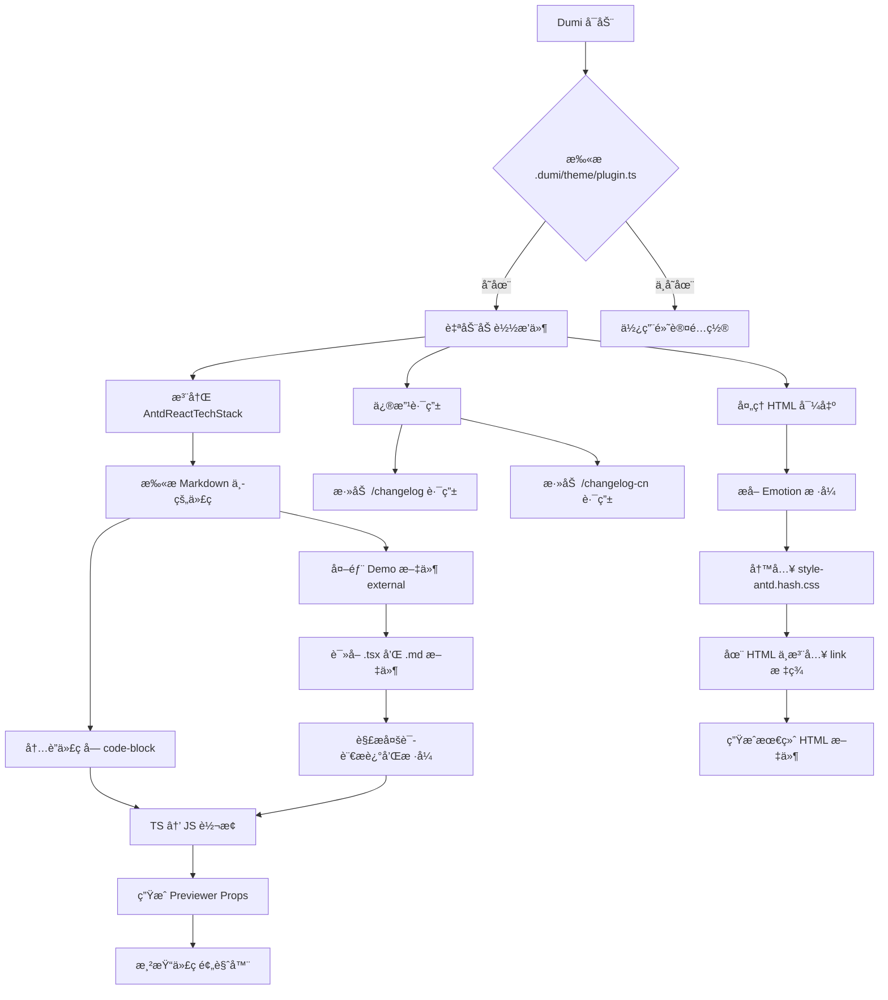

### **3ï¸âƒ£ 工作æµç¨‹å›¾**



---

### **4ï¸âƒ£ 关键代ç æ®µè¯´æ˜**

#### **a) Tech Stack 扩展**

```typescript
// 为在线编辑器注入ä¾èµ–ä¿¡æ¯
props.pkgDependencyList = { ...devDependencies, ...dependencies };

// TypeScript 转 JavaScript
props.jsx = tsToJs(code);

// 解æ Demo 的多语言æè¿°
props.description = blocks[locale]; // 'zh-CN' 或 'en-US'
props.style = blocks.style; // 自定义样å¼
```

#### **b) 路由扩展**

```typescript
// 添加 Changelog 路由（monorepo 根目录的 CHANGELOG 文件）
{
  id: 'changelog-cn',
  path: 'changelog-cn',
  file: resolve('../../../../CHANGELOG.zh-CN.md'),
}
```

#### **c) SSR æ ·å¼ä¼˜åŒ–**

```typescript
// 1. æå– Emotion æ ·å¼
const styles = extractEmotionStyle(file.content);

// 2. 写入独立 CSS 文件
const cssFile = writeCSSFile('antd', ids.join(''), cssContent);

// 3. 注入 <link> 标签
html.replace('</head>', `<link rel="stylesheet" href="${cssFile}"></head>`);
```

---

### **5ï¸âƒ£ 为什么需è¦è¿™ä¸ªæ’件？**

| 问题                        | 解决方案                            |
| --------------------------- | ----------------------------------- |
| ⌠用户åªä¼š JS，ä¸ä¼š TS     | ✅ è‡ªåŠ¨è½¬æ¢ TS → JS，用户å¯ç›´æ¥å¤åˆ¶ |
| ⌠在线编辑器缺少ä¾èµ–ä¿¡æ¯   | ✅ 自动注入 `package.json` ä¾èµ–     |
| ⌠Demo 文档分散在多个文件  | ✅ 自动解æ `.md` å’Œ `.tsx` 文件    |
| ⌠Changelog ä¸åœ¨æ–‡æ¡£ç›®å½•   | ✅ 手动添加路由引入根目录文件       |
| ⌠SSR 首å±æ ·å¼é—ªçƒï¼ˆFOUC） | ✅ æå– CSS-in-JS 为独立文件        |

---

### **6ï¸âƒ£ ä¸ `.dumirc.ts` 的关系**

```typescript
// .dumirc.ts (é…置文件)
export default defineConfig({
  ssr: { builder: 'mako' }, // é…ç½® SSR
  hash: true, // é…置文件哈希
  // ...
});

// .dumi/theme/plugin.ts (æ’件文件)
// - ä¸éœ€è¦åœ¨ .dumirc.ts 中引入
// - 自动加载，å¢å¼º Dumi 的功能
// - 处ç†æ›´åº•å±‚的逻辑（路由ã€HTMLã€æ ·å¼ï¼‰
```

**区别：**

- **`.dumirc.ts`** = 用户é…置（声æ˜å¼ï¼‰
- **`plugin.ts`** = æ’件逻辑（编程å¼ï¼‰

---

### **7ï¸âƒ£ 类比ç†è§£**

```
Dumi æ¡†æ¶ = 房å­çš„框æ¶
.dumirc.ts = 装修方案（选择地æ¿ã€å¢™çº¸ã€å®¶å…·ï¼‰
plugin.ts = 水电工程师（改造电路ã€å¢åŠ æ’座ã€ä¼˜åŒ–管é“）

约定å¼åŠ è½½ = 装修公å¸çœ‹åˆ° .dumi/theme/plugin.ts 就知é“è¦å¯ç”¨å®šåˆ¶å·¥ç¨‹
```

---

## 🯠总结

这个æ’件是 **Ant Design X 文档站点的核心定制逻辑**，通过 Dumi 的约定å¼åŠ è½½æœºåˆ¶ï¼Œè‡ªåŠ¨å¢å¼ºäº†ï¼š

1. ✅ **å¼€å‘体验** - TS → JS 自动转æ¢
2. ✅ **在线预览** - ä¾èµ–ä¿¡æ¯è‡ªåŠ¨æ³¨å…¥
3. ✅ **多语言支æŒ** - Demo 文档解æ
4. ✅ **性能优化** - SSR æ ·å¼æå–
5. ✅ **路由扩展** - Changelog 页é¢

所有这些功能都**无需é…ç½®**，Dumi å¯åŠ¨æ—¶è‡ªåŠ¨åŠ è½½ï¼ğŸš€

---

让我分æ Dumi çš„å¯åŠ¨å’Œæ–‡ä»¶åŠ è½½é¡ºåºï¼Œé€šè¿‡æœç´¢ç›¸å…³é…置和约定æ¥ç†è§£æ•´ä¸ªæµç¨‹ï¼š

ç°åœ¨è®©æˆ‘æœç´¢ Dumi 的官方文档和约定å¼åŠ è½½é¡ºåºï¼š

ç°åœ¨è®©æˆ‘创建一个完整的 Dumi 文件加载顺åºå›¾ï¼š

## 📚 Dumi 文件加载顺åºè¯¦è§£

åŸºäº Dumi 的约定å¼æ¶æ„和你的项目å®é™…情况，完整的加载顺åºå¦‚下：

---

## 🔄 完整加载æµç¨‹ï¼ˆä»å¯åŠ¨åˆ°æ¸²æŸ“）

```mermaid
graph TB
    Start[npm run start / dumi dev] --> Config[1. è¯»å– .dumirc.ts]

    Config --> Plugin1[2. 自动加载 .dumi/theme/plugin.ts]
    Plugin1 --> |注册 TechStack| P1[扩展 ReactTechStack]
    Plugin1 --> |修改路由| P2[添加 Changelog 路由]
    Plugin1 --> |SSR é’©å­| P3[HTML æ ·å¼æå–]

    Config --> GlobalFiles[3. 加载全局约定文件]
    GlobalFiles --> G1[.dumi/global.css - 全局样å¼]
    GlobalFiles --> G2[.dumi/loading.js - 加载动画]

    Config --> Theme[4. 加载主题é…ç½®]
    Theme --> T1[.dumi/theme/themeConfig.ts]

    Theme --> Layout[5. 加载布局组件]
    Layout --> L1[layouts/GlobalLayout.tsx - 全局布局]
    Layout --> L2[layouts/DocLayout.tsx - 文档布局]
    Layout --> L3[layouts/IndexLayout.tsx - 首页布局]

    L1 --> Provider[6. åˆå§‹åŒ– Provider]
    Provider --> PP1[SiteThemeProvider - 主题]
    Provider --> PP2[ConfigProvider - Antd é…ç½®]
    Provider --> PP3[StyleProvider - CSS-in-JS]
    Provider --> PP4[SiteContext - 站点状æ€]

    PP1 --> Styles[7. 注入全局样å¼]
    Styles --> S1[GlobalStyles 组件]
    S1 --> S2[Reset.tsx - é‡ç½®æ ·å¼]
    S1 --> S3[Common.tsx - 通用样å¼]
    S1 --> S4[Markdown.tsx - Markdown æ ·å¼]
    S1 --> S5[Highlight.tsx - 代ç é«˜äº®]
    S1 --> S6[其他样å¼ç»„件...]

    Styles --> Scan[8. 扫æ文档和组件]
    Scan --> Doc1[docs/ - 文档目录]
    Scan --> Doc2[components/ - 组件目录]
    Scan --> Doc3[æ ¹æ® .dumirc.ts çš„ resolve é…ç½®]

    Doc1 --> Route[9. 生æˆè·¯ç”±]
    Doc2 --> Route
    Doc3 --> Route
    Route --> R1[/components/bubble]
    Route --> R2[/guide/start]
    Route --> R3[/changelog é¢å¤–路由]

    Route --> Render[10. 渲染页é¢]
    Render --> Page1[Header - 导航æ ]
    Render --> Page2[Sidebar - 侧边æ ]
    Render --> Page3[Content - 内容区]
    Render --> Page4[Footer - 页脚]

    Page3 --> Demo[11. å¤„ç† Demo]
    Demo --> Tech[TechStack 处ç†]
    Tech --> TS[TS → JS 转æ¢]
    Tech --> Deps[注入ä¾èµ–ä¿¡æ¯]
    Tech --> MDParse[解æ Demo çš„ .md]

    Demo --> Previewer[12. 渲染 Previewer]
    Previewer --> Code[代ç å±•ç¤º]
    Previewer --> Preview[效æœé¢„览]
    Previewer --> Actions[æ“作按钮]
```

---

## 📂 详细加载顺åºè¡¨

### **阶段 1: é…ç½®åˆå§‹åŒ–（å¯åŠ¨æ—¶ï¼‰**

| é¡ºåº | 文件路径                     | 作用                       | 是å¦çº¦å®šå¼  |
| ---- | ---------------------------- | -------------------------- | ----------- |
| 1    | `.dumirc.ts`                 | 主é…置文件                 | ✅          |
| 2    | `.dumi/theme/plugin.ts`      | 自定义æ’件                 | ✅ 自动加载 |
| 3    | `.dumi/theme/themeConfig.ts` | 主题é…置（导航ã€åˆ†ç±»æ’åºï¼‰ | ⌠手动导入 |

---

### **阶段 2: 全局资æºåŠ è½½ï¼ˆæ„建时）**

| é¡ºåº | 文件路径           | 加载时机      | è¯´æ˜             |
| ---- | ------------------ | ------------- | ---------------- |
| 4    | `.dumi/global.css` | HTML `<head>` | 全局 CSS æ ·å¼    |
| 5    | `.dumi/loading.js` | 首å±åŠ è½½      | Loading 动画组件 |

---

### **阶段 3: React 组件树åˆå§‹åŒ–（è¿è¡Œæ—¶ï¼‰**

| é¡ºåº | 组件路径 | 层级 | è¯´æ˜ |
| --- | --- | --- | --- |
| 6 | `layouts/GlobalLayout.tsx` | 🌳 根布局 | 最外层布局，包å«æ‰€æœ‰é¡µé¢ |
| 7 | `SiteThemeProvider.tsx` | ↓ Theme Provider | antd-style 主题æ供者 |
| 8 | `common/GlobalStyles.tsx` | ↓ 全局样å¼æ³¨å…¥ | 通过 `<Global>` 注入 CSS-in-JS |
| 9 | `layouts/DocLayout.tsx` | ↓ 文档布局 | 文档页é¢çš„布局（Header + Sidebar + Content） |
| 10 | `layouts/IndexLayout.tsx` | ↓ 首页布局 | 首页专用布局 |

---

### **阶段 4: GlobalStyles 内部加载顺åº**

```tsx
// GlobalStyles.tsx 的加载顺åº
<>
  <Reset /> // 1. é‡ç½®æµè§ˆå™¨é»˜è®¤æ ·å¼
  <Common /> // 2. 通用样å¼ï¼ˆå¸ƒå±€ã€é—´è·ï¼‰
  <Markdown /> // 3. Markdown 内容样å¼
  <Highlight /> // 4. 代ç é«˜äº®æ ·å¼
  <Demo /> // 5. Demo 示例样å¼
  <Responsive /> // 6. å“应å¼æ ·å¼
  <NProgress /> // 7. 进度æ¡æ ·å¼
  <PreviewImage /> // 8. 图片预览样å¼
  <InlineCard /> // 9. 内è”å¡ç‰‡æ ·å¼
  <ColorStyle /> // 10. 颜色相关样å¼
  <HeadingAnchor /> // 11. 标题锚点样å¼
  <SearchBar /> // 12. æœç´¢æ¡†æ ·å¼
</>
```

---

### **阶段 5: 页é¢å¸ƒå±€ç»„件加载（按层级）**

#### **DocLayout（文档页é¢ï¼‰**

```
DocLayout
├── Header          (.dumi/theme/slots/Header/)
│   ├── Logo
│   ├── Navigation
│   └── Actions
├── Sidebar         (.dumi/theme/slots/Sidebar/)
│   └── Menu
├── Content         (.dumi/theme/slots/Content/)
│   ├── DocMeta     (文档元信æ¯)
│   ├── DocAnchor   (å³ä¾§é”šç‚¹)
│   └── Markdown    (å®é™…内容)
└── Footer          (.dumi/theme/slots/Footer/)
```

---

### **阶段 6: Demo 处ç†æµç¨‹ï¼ˆæ–‡æ¡£ä¸­çš„代ç ç¤ºä¾‹ï¼‰**

| é¡ºåº | 处ç†æ­¥éª¤      | è´Ÿè´£æ¨¡å—             | è¯´æ˜                                  |
| ---- | ------------- | -------------------- | ------------------------------------- |
| 1    | 扫æ Markdown | Dumi 核心            | 查找 ` ```tsx` 代ç å—å’Œ `<code>` 标签 |
| 2    | è¯†åˆ«ç±»å‹      | TechStack            | `code-block` 或 `external`            |
| 3    | 调用æ’件      | `AntdReactTechStack` | ç”Ÿæˆ Previewer Props                  |
| 4    | 读å–文件      | Plugin               | `.tsx` + `.md` 文件                   |
| 5    | TS → JS       | `tsToJs()`           | TypeScript 转 JavaScript              |
| 6    | 解æ文档      | Plugin               | æå–中英文æè¿°å’Œæ ·å¼                  |
| 7    | 渲染组件      | `Previewer`          | 展示代ç å’Œæ•ˆæœ                        |

---

### **阶段 7: 内置组件加载（按需加载）**

这些组件在 Markdown 中使用时æ‰ä¼šåŠ è½½ï¼š

```markdown
<!-- 在 Markdown 中使用内置组件 -->

<ComponentOverview /> ↠builtins/ComponentOverview/ <InstallDependencies /> ↠builtins/InstallDependencies/ <Previewer /> ↠builtins/Previewer/ <ColorPalettes /> ↠builtins/ColorPalettes/
```

---

## 🯠关键约定å¼è·¯å¾„总结

| 路径                                   | 自动加载 | 作用         |
| -------------------------------------- | -------- | ------------ |
| `.dumirc.ts`                           | ✅       | 主é…置文件   |
| `.dumi/global.css`                     | ✅       | 全局 CSS     |
| `.dumi/loading.js`                     | ✅       | Loading 组件 |
| `.dumi/theme/plugin.ts`                | ✅       | 自定义æ’件   |
| `.dumi/theme/layouts/GlobalLayout.tsx` | ✅       | 全局布局     |
| `.dumi/theme/layouts/DocLayout.tsx`    | ✅       | 文档布局     |
| `.dumi/theme/builtins/**/*.tsx`        | ✅       | 内置组件     |
| `.dumi/theme/slots/**/*.tsx`           | ✅       | æ’槽组件     |
| `.dumi/theme/locales/*.json`           | ✅       | 国际化文件   |

---

## 🔠加载顺åºå¯¹æ¯”：process.cwd() vs \_\_dirname

```typescript
// å¯åŠ¨å‘½ä»¤
cd /Users/peisenxu/Desktop/x
npm run start

// 加载过程
1. è¯»å– .dumirc.ts
   - process.cwd() = /Users/peisenxu/Desktop/x  ↠执行命令的目录
   - __dirname = /Users/peisenxu/Desktop/x/packages/x  ↠é…置文件所在目录

2. 自动加载 .dumi/theme/plugin.ts
   - Dumi 内部使用 __dirname 解æ约定路径
   - ä¸å— process.cwd() å½±å“

3. 扫æ文档和组件
   - æ ¹æ® .dumirc.ts 中的 resolve.docDirs é…ç½®
   - è·¯å¾„åŸºäº __dirname（é…置文件所在目录）
```

---

## 💡 执行æµç¨‹æ€»ç»“

```
å¯åŠ¨å‘½ä»¤
  ↓
è¯»å– .dumirc.ts（é…置优先级最高）
  ↓
加载 plugin.ts（注册钩å­å’Œæ‰©å±•ï¼‰
  ↓
加载 global.css å’Œ loading.js（全局资æºï¼‰
  ↓
åˆå§‹åŒ– React 组件树（GlobalLayout → Provider → Styles）
  ↓
扫ææ–‡æ¡£å’Œç»„ä»¶ï¼ˆæ ¹æ® resolve é…置）
  ↓
生æˆè·¯ç”±
  ↓
渲染页é¢ï¼ˆLayout → Slots → Content → Demo）
  ↓
å¤„ç† Demo（TechStack → TS è½¬æ¢ â†’ Previewer）
```

---

## 🚀 快速记忆

1. **é…置先行** - `.dumirc.ts` 是一切的起点
2. **约定自动** - `.dumi/theme/plugin.ts` 等约定路径自动加载
3. **布局嵌套** - GlobalLayout → DocLayout → Slots → Content
4. **æ ·å¼æ³¨å…¥** - GlobalStyles 在 GlobalLayout 中统一注入
5. **Demo 处ç†** - Plugin çš„ TechStack 负责转æ¢å’Œå¢å¼º

这就是 Dumi 完整的文件加载顺åºï¼ğŸ‰
